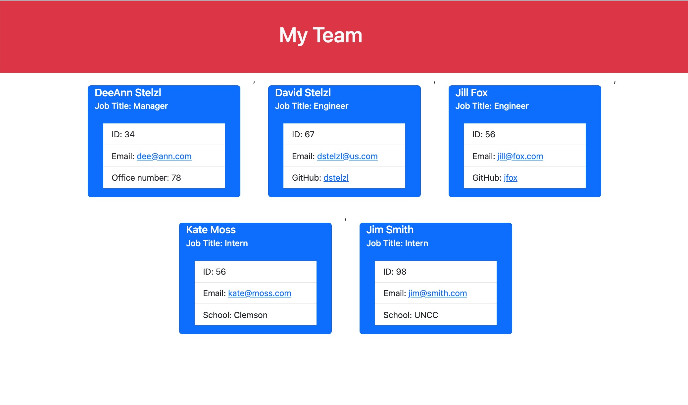

# Team Profile Generator

## Table of Contents

1. [Description](#description)
2. [Visuals](#visuals)
3. [Testing](#testing)
4. [Contributing](#contributing)

## Description

User starts by typing in the node index.js command into the terminal and then answers a series of questions for each employee on the team. Once completed they select "finish" and an html page is generated with a card for each of the team mebers displaying all of their information.

## Visuals

## Testing

Tests for each type of emplyee are set up in the __tests__ folder. Enter "npm run test" in the terminal to check if code is working.

## Contributing

Designed by Deborah DeeAnn Stelzl